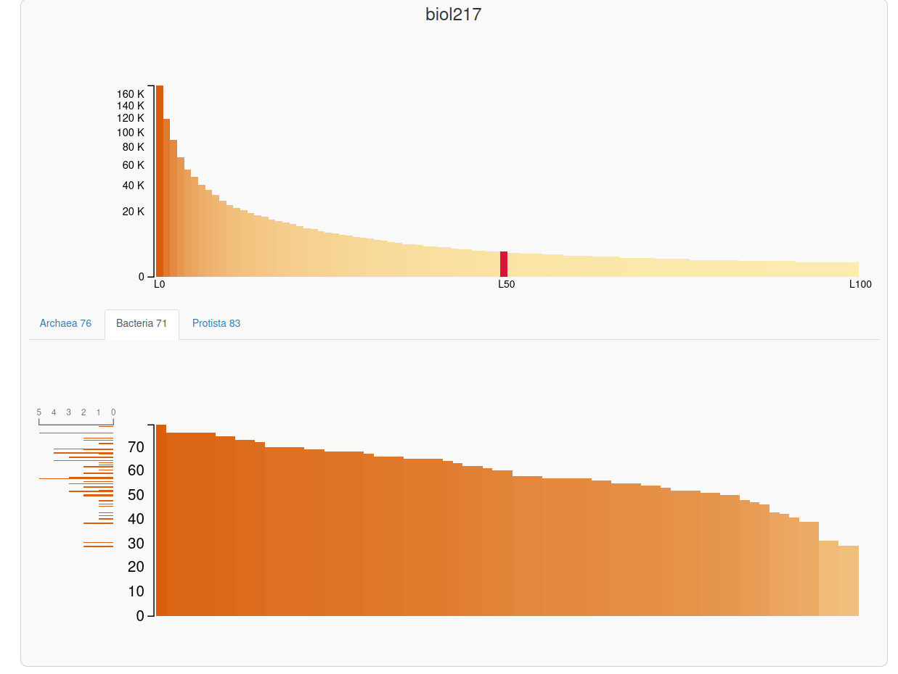
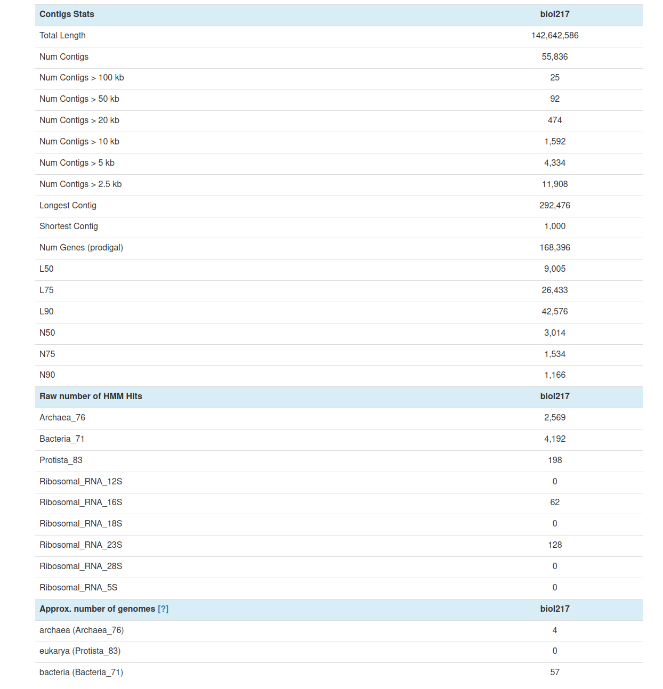
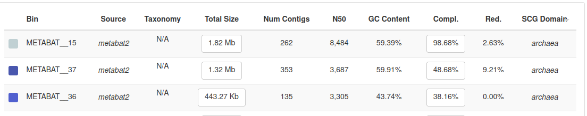
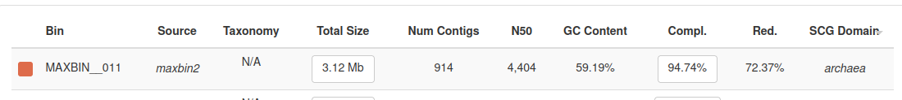

# Mapping Sequencing Reads to Assembled Contigs and Binning reads


## Evaluating Assembly Quality
First, we need to evaluate the quality of the genome assemblies usig `queast`

```
#!/bin/bash
#SBATCH --job-name=test2
#SBATCH --output=test2.out
#SBATCH --error=test2.err
#SBATCH --nodes=1
#SBATCH --ntasks-per-node=1
#SBATCH --cpus-per-task=12
#SBATCH --mem=32G
#SBATCH --partition=base
#SBATCH --time=3:00:00
#SBATCH --reservation=biol217 
```
Activate micromba tools in the terminal or just write direct in the batch script

```
micromamba activate 00_anvio
```
Create a new directory (optinal) and run `metaquast` or `quast` depends on internet conection
```
cd $WORK
mkdir day3
cd day3
metaquast $WORK/final.contigs.fa -o $WORK/day3/metaquast_out -t 6 -m 1000
````
####        QUESTIONS

    What is your N50 value? Why is this value relevant?
    How many contigs are assembled?
    What is the total length of the contigs?

### Re-formatting the contigs
To simplify sequence IDs and filter out short contigs, we will use `anvi-script-reformat-fasta.`
```
anvi-script-reformat-fasta $WORK/final.contigs.fa -o $WORK/day3/anvi_out.fa --min-len 1000 --simplify-names --report-file simplify_names
```
### Indexing the contigs
To run faster mapping we need to organize and index using `bowtie2`
```
bowtie2-build $WORK/day3/anvi_out.fa $WORK/day3/contings_anvi.fa.index
```
**Note:** bowtie2-build will split the index into multiple files like .1.bt2, .2.bt2, .3.bt2, and so on. Do not touch them.
**Only work with** contigs.anvio.fa.index.

### Mapping reads onto contigs
Use the main `bowtie2` program for the actual mapping.

```
bowtie2 -1 $WORK/day2/BGR_130305_mapped_R1_cleaned.fastq.gz -2 $WORK/day2/BGR_130305_mapped_R2_cleaned.fastq.gz -x  $WORK/day3/contings_anvi.fa.index -S BGR_130305.sam --very-fast 
bowtie2 -1 $WORK/day2/BGR_130527_mapped_R1_cleaned.fastq.gz -2 $WORK/day2/BGR_130527_mapped_R2_cleaned.fastq.gz -x  $WORK/day3/contings_anvi.fa.index -S BGR_130527.sam --very-fast 
bowtie2 -1 $WORK/day2/BGR_130708_mapped_R1_cleaned.fastq.gz -2 $WORK/day2/BGR_130708_mapped_R2_cleaned.fastq.gz -x $WORK/day3/contings_anvi.fa.index -S BGR_130708.sam --very-fast 
```
In the end, there should be 3 .sam files and we need them into machine language (binary)
```
samtools view -Sb $WORK/day3/BGR_130305_mapped.sam > $WORK/day3/BGR/BGR_130305_mapped2.bam
#samtools view -Sb $WORK/day3/BGR_130527_mapped.sam > $WORK/day3/BBGR_130527_mapped2.bam
#samtools view -Sb $WORK/day3/BGR_130708_mapped.sam > $WORK/day3/BGR_130708_mapped2.bam
```
### Sorting mapped reads

To speeds up data processing and allows you to do downstream analyses(visualization and variant calling), we will use `anvi-init-bam`, which not only sorts but also indexes the .bam files (in just one command).

```
anvi-init-bam $WORK/day3/BGR_130305_mapped2.bam -o $WORK/day3/BGR_130305_sorted.bam
anvi-init-bam $WORK/day3/BGR_130527_mapped2.bam -o $WORK/day3/BGR_130527_sorted.bam
anvi-init-bam $WORK/day3/BGR_130708_mapped2.bam -o $WORK/day3/BGR_130708_sorted.bam
```
**Note:** The command will automatically generate .bam.bai files. They are the index files. Do not touch them.
**Only work with the** sorted .bam.

## Binning reads
We are ready to bin our contigs into individual genomes (MAGs) and start to figure out which microbes are present in the samples.

### Generating contigs database
The fasta format of the contigs is limited and cannot store more complex types of information. To convert we use `anvi-gen-contigs-database`:
```
#anvi-gen-contigs-database -f $WORK/day3/anvi_out.fa -o $WORK/day3/contigs.db -n biol217
```
### Annotating ORFs
```
anvi-run-hmms -c $WORK/day3/contigs.db --num-threads 4
```
### Visualizing the contigs database
#### Initiate an interactive session
```
srun --pty --x11 --partition=interactive --nodes=1 --tasks-per-node=1 --cpus-per-task=1 --mem=10G --time=01:00:00 /bin/bash
```
#### Run your interactive processes
```
module load gcc12-env/12.1.0
module load micromamba 2> /dev/null/
cd $WORK
micromamba activate $WORK/.micromamba/envs/00_anvio/
```
#### Connect to the interactive web server
```
ssh -L localhost:8080:localhost:8080 sunamNNN@caucluster.rz.uni-kiel.de
```
**Note:** if the server change (local host) you must change,the sunamnNN conected to a node nNN and it change everytime it can be 246, 247 or 248
```
ssh -L localhost:8080:localhost:8080 nNNN

Run the interactive command
```
#anvi-display-contigs-stats $WORK/day3//contigs.db
```




### Creating an anvi'o profile
```
anvi-profile -i $WORK/day3/BGR_130305_sorted.bam -c $WORK/day3/contigs.db -o $WORK/day3/BGR_130305_profile/
anvi-profile -i $WORK/day3/BGR_130527_sorted.bam -c $WORK/day3/contigs.db -o $WORK/day3/BGR_130527_profile/
anvi-profile -i $WORK/day3/BGR_130708_sorted.bam -c $WORK/day3/contigs.db -o $WORK/day3/BGR_130708_profile/
```
### Merging anvi'o profiles from all samples
Merging anvi'o profiles from all samples
```
anvi-merge $WORK/day3/BGR_130305_profile/PROFILE.db $WORK/day3/BGR_130527_profile/PROFILE.db $WORK/day3/BGR_130708_profile/PROFILE.db  -o $WORK/day3/merged_profiles  -c $WORK/day3/contigs.db --enforce-hierarchical-clustering
```
### Binning contigs into genomes
Using MetaBAT2
```
anvi-cluster-contigs -p $WORK/day3/merged_profiles/PROFILE.db -c $WORK/day3/contigs.db -C METABAT2 --driver metabat2 --log-file $WORK/day3/metabait2.log --just-do-it
```
Using MaxBin2
```
anvi-summarize -p $WORK/day3/merged_profiles/PROFILE.db -c $WORK/day3/contigs.db -o $WORK/day3/summary_metaba2 -C METABAT2
```
#### QUESTIONS

    How many A R C H A E A bins did you get from MetaBAT2? 3
    
    How many A R C H A E A bins did you get from Maxbin2?
    
