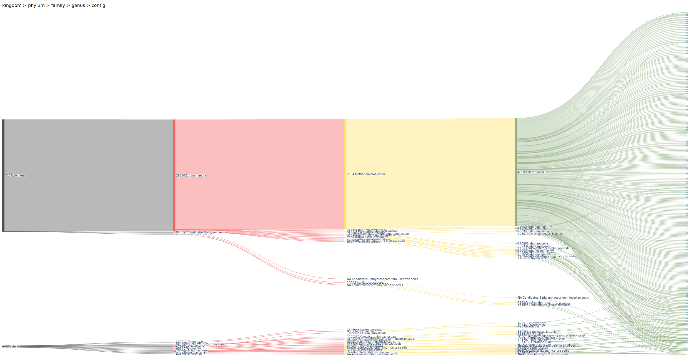
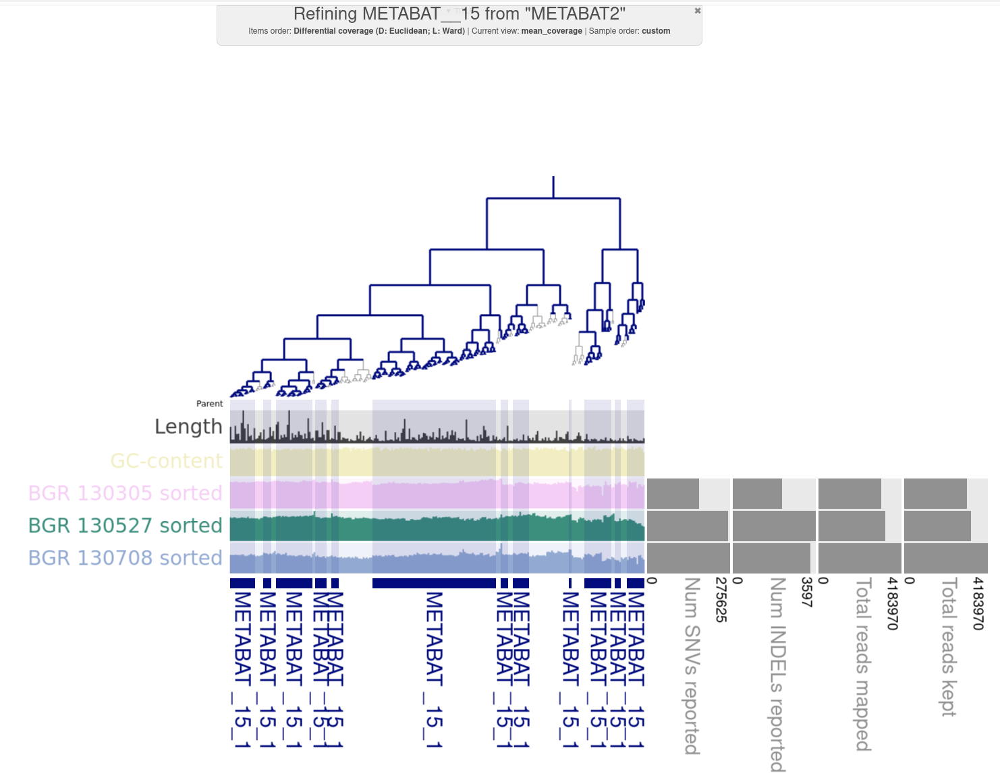
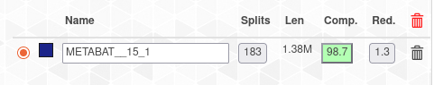

# Evaluating MAGs Quality
We examined the bins we got in day 3 and and we tried to improve their quaility
## Estimating genome completeness
To evaluate complete and redundant values for each of the bin (MAG) is with: `anvi-estimate-genome-completeness`
```
anvi-estimate-genome-completeness -c $WORK/day3/contigs.db -p $WORK/day3/merged_profiles/PROFILE.db -C METABAT2
```
To only check what bin collections you have generated (without calculating genome completeness):
```
anvi-estimate-genome-completeness --list-collections -p $WORK/day3/merged_profiles/PROFILE.db -c $WORK/day3/contigs.db
```
 

## Examining bins manually

Inciate and run interactive process like day3
 ```
 anvi-interactive -p $WORK/day3/merged_profiles/PROFILE.db -c $WORK/day3/contigs.db -C METABAT2
```

### Questions

 Which binning strategy gives you the best quality for the A R C H A E A bins? **METABINS**

How many A R C H A E A bins do you get that are of High quality? **1**
How many B A C T E R I A bins do you get that are of High quality?**4**
.png)


## Refining Archaea bins

Copy the fasta files of the biens with high quality to a new directory for refining 

In this case **METABAT__15**
### Detecting chimeras in MAGs

Use `GUNC` to check for chimeras and potential contamination.
```
micromamba activate 00_gunc
mkdir refine
cp METABAT__15-contigs.fa
gunc run -i $WORK/day4/refine/METABAT__15-contigs.fa -r $WORK/databases/gunc/gunc_db_progenomes2.1.dmnd --out_dir $WORK/day4/gunc_out --detailed_output --threads 12
````

### Creating interactive plots of the chimeras
```
gunc plot -d $WORK/day4/gunc_out/diamond_output/*.diamond.progenomes_2.1.out  -g $WORK/day4/gunc_out/gene_calls/gene_counts.json --out_dir $WORK/day4/gunc_out/gunc
```

#### Questions
Do you get A R C H A E A bins that are chimeric?

In your own words, briefly explain what a chimeric bin is.

## Manual bin refinement
Inciate and run interactive process like day3
```
cp $WORK/day3/merged_profiles/PROFILE.db $WORK/day4/PROFILE.db
anvi-refine -c $WORK/day3/contigs.db -p $WORK/day4/PROFILE.db --bin-id METABAT__15 -C METABAT2 
```


How much could you improve the quality of your A R C H A E A ? **98.6 to 98.7** and reduce to **1.3**



**FALTA** make gunC for the 3 samples of archea of low quaility
How abundant (relatively) are the A r c h a e a bins in the 3 samples?