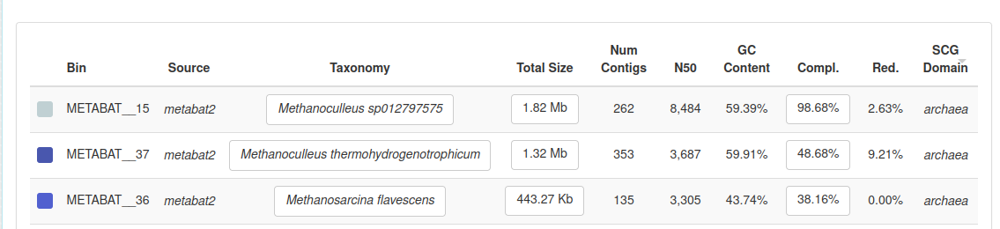
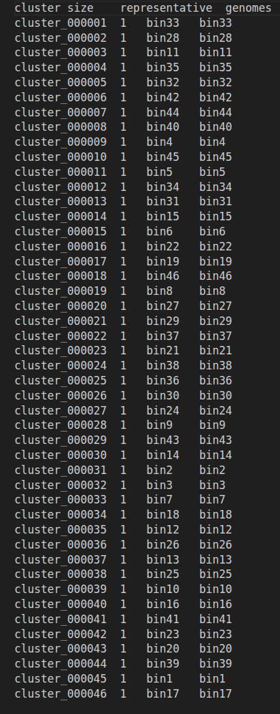

# Taxonomic annotations
`anvi-run-scg-taxonomy` associates the single-copy core genes in your contigs-db with taxnomy information.

```
anvi-run-scg-taxonomy -c $WORK/day3/contigs.db -T 20 -P 2
```
makes quick taxonomy estimates for genomes, metagenomes, or bins stored in your contigs-db using single-copy core genes.
```
#anvi-estimate-scg-taxonomy -c $WORK/day3/contigs.db -p $WORK/day3/merged_profiles/PROFILE.db --metagenome-mode --compute-scg-coverages --update-profile-db-with-taxonomy > abundance.txt
````


Then run  `run anvi-estimate-scg-taxonomy`

#### Questions
Did you get a species assignment to the A R C H A E A bins previously identified?
Does the HIGH-QUALITY assignment of the bin need revision?


## Genome dereplication
make a table with all the bins
```
anvi-dereplicate-genomes -i $WORK/day5/dereplicationall.tsv --program fastANI --similarity-threshold 0.95 -o $WORK/day5/dereplication_all_ANI --log-file log_ANI -T 10 --force-overwrite
```

