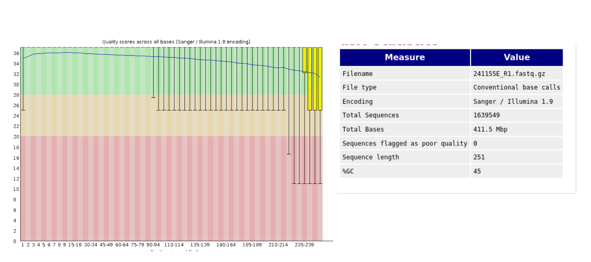
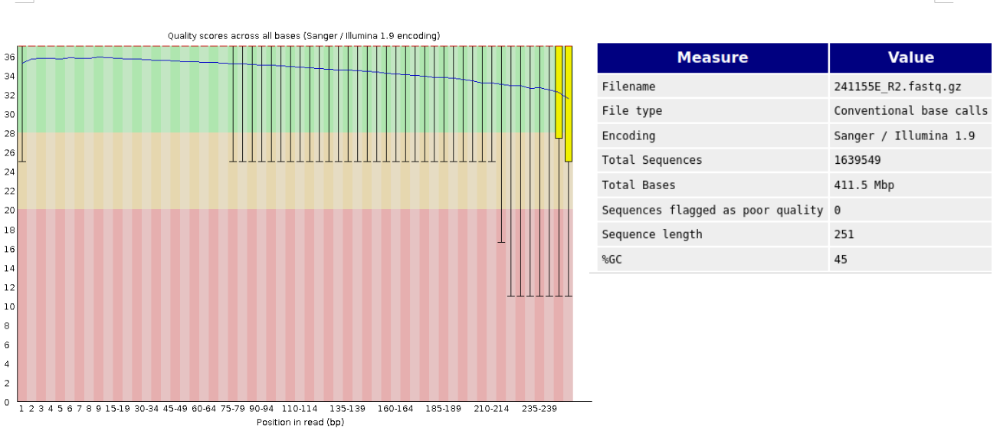
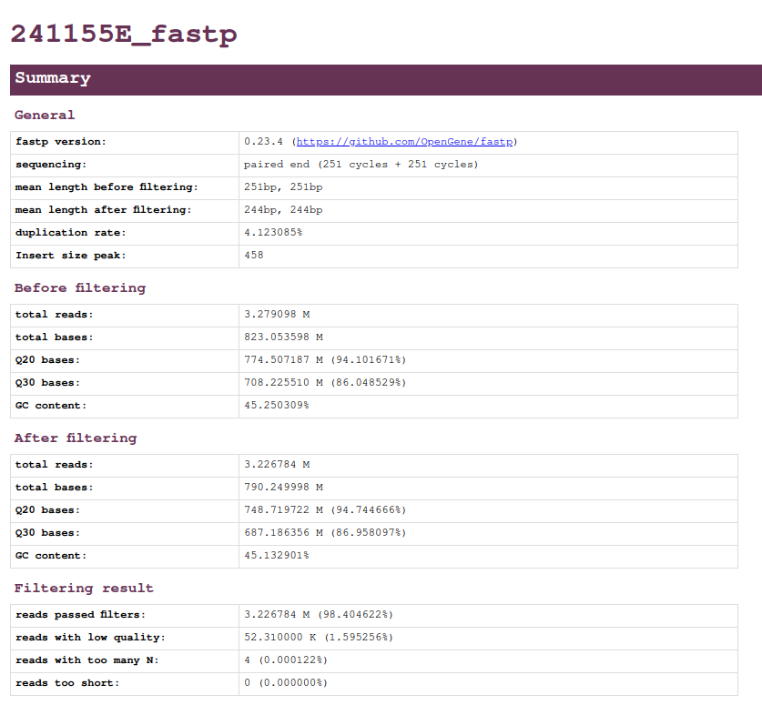
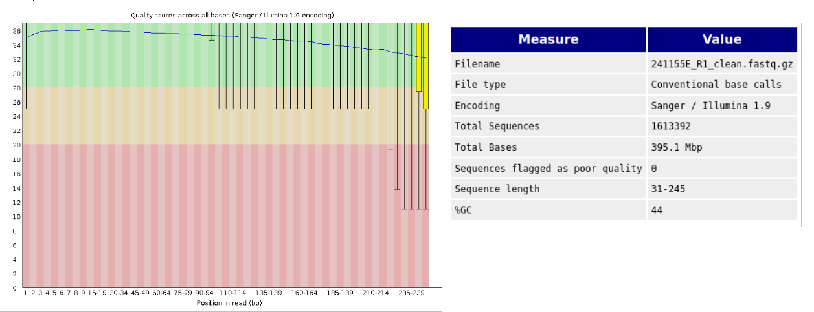
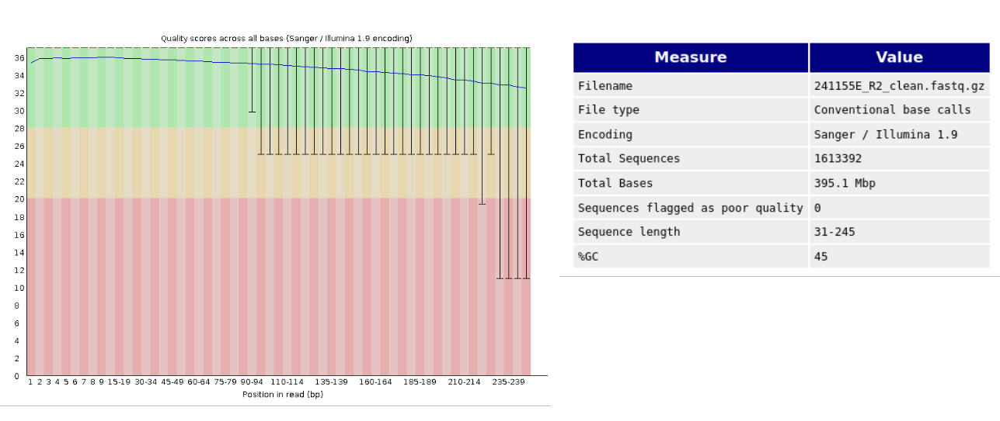
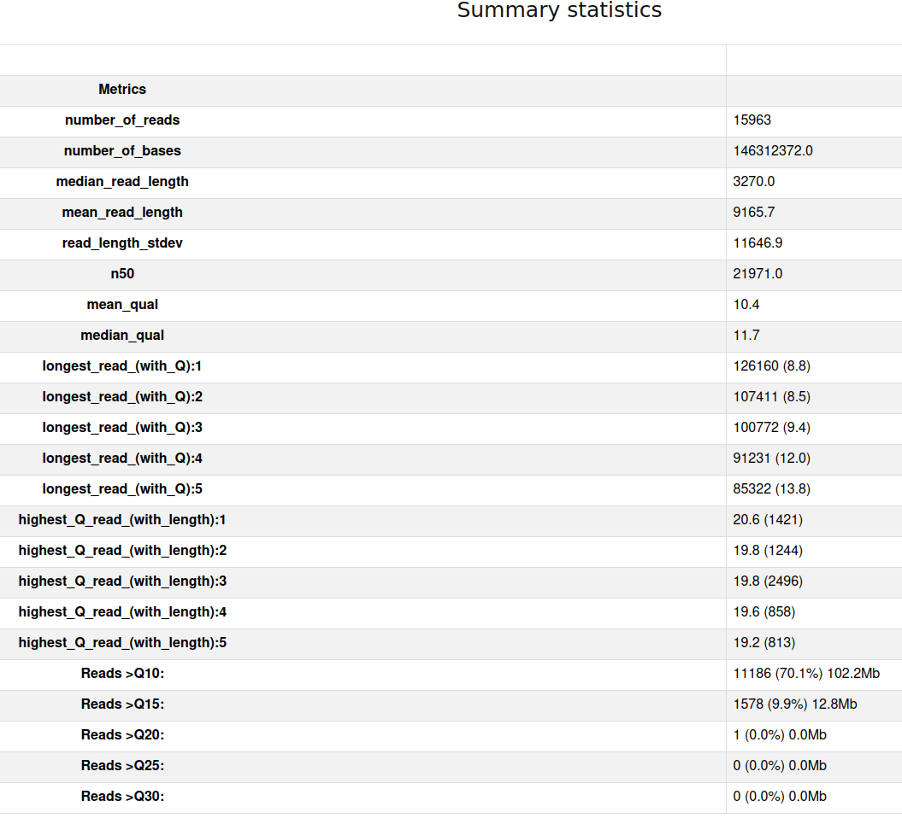
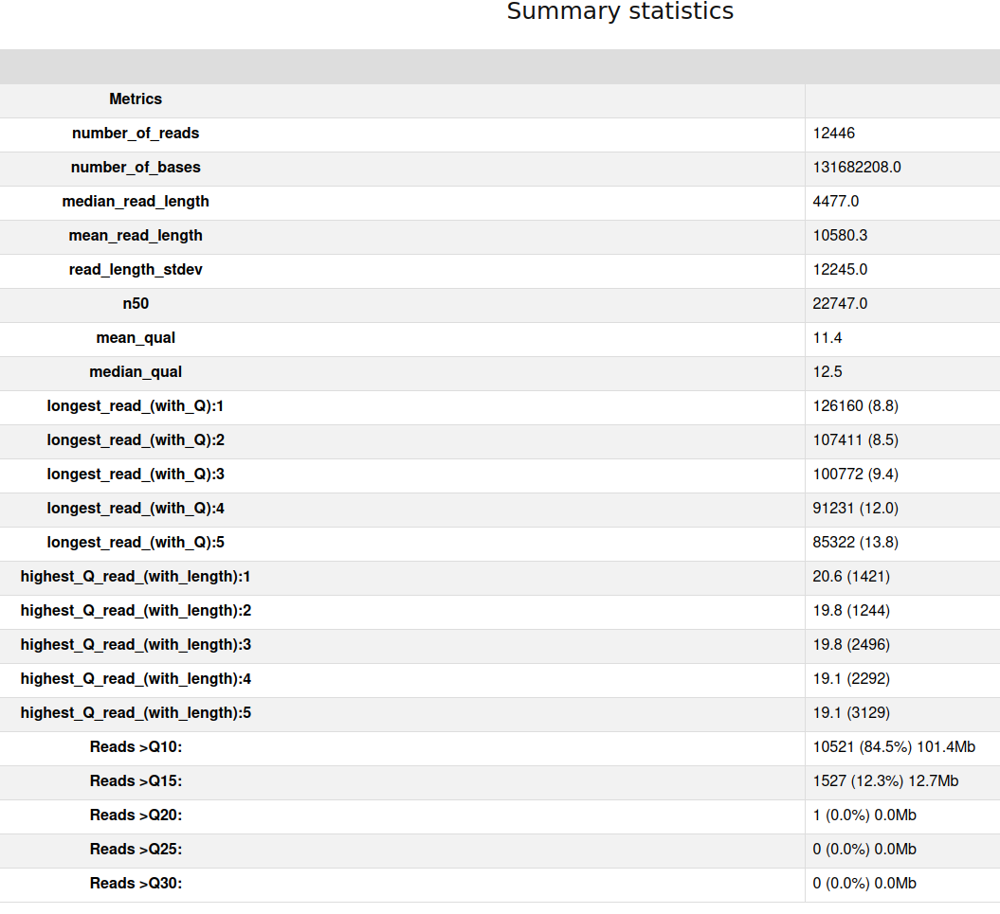

# Genomics

## Quality control of SHORT raw reads
First, we need to evaluate the quality of the sequenced data, make a batch script:

Activate micromba tools in the terminal or just write direct in the batch script

```
#micromamba activate 01_short_reads_qc
```
Run `fastqc` the file are 0_raw_reads in genomic directory, you could work either there or make a new directory

|Short reads | Long reads |  |
| --- | --- | --- |
| 241155E_R1.fastq.gz | 241155E.fastq.gz | 
| 241155E_R2.fastq.gz|  | 
```
cd $WORK/day6
mdir day6
mkdir -p $WORK/day6/short_reads_out
for i in ../genomics/0_raw_reads/short_reads/*.gz
do 
  fastqc $i -o $WORK/day6/short_reads_out/  -t 8
done
````
Run `fastp` 
```
mkdir -p $WORK/day6/short_reads_out/fastp
fastp -i ../genomics/0_raw_reads/short_reads/241155E_R1.fastq.gz -I ../genomics/0_raw_reads/short_reads/241155E_R2.fastq.gz -R 241155E_fastp -h 241155E.html  -o  $WORK/day6/short_reads_out/fastp/241155E_R1_clean.fastq.gz -O $WORK/day6/short_reads_out/fastp/241155E_R2_clean.fastq.gz   -t 6 -q 25
```
Check the quality of the cleaned reads with fastqc again

```
for i in $WORK/day6/short_reads_out/fastp/*.gz
do 
  fastqc $i -o $WORK/day6/short_reads_out/  -t 8
done
```
#### Questions
How Good is the read quality? **NICE**


How many reads before trimming and how many do you have now?

Did the quality of the reads improve after trimming?



## Long reads

We will used `nanoplot`

```
micromamba activate 02_long_reads_qc
cd $WORK/day6 
mkdir -p $WORK/day6/long_reads_out

NanoPlot --fastq ../genomics/0_raw_reads/long_reads/*.gz -o $WORK/day6/long_reads_out -t 6 --maxlength 40000 --minlength 1000 --plots kde --format png --N50 --dpi 300 --store --raw --tsv_stats --info_in_report
```

For filtering long reads by quality. we used `filtlong`
```
mkdir -p $WORK/day6/long_reads_out/clean_long_reads
filtlong --min_length 1000 --keep_percent 90 ../genomics/0_raw_reads/long_reads/*.gz  | gzip > $WORK/day6/long_reads_out/clean_long_reads/241155E_cleaned_filtlong.fastq.gz
```
Check the quality of the cleaned reads with nanoplot again
```
mkdir -p $WORK/day6/long_reads_out/clean_nanoplot
NanoPlot --fastq $WORK/day6/long_reads_out/clean_long_reads/241155E_cleaned_filtlong.fastq.gz -o $WORK/day6/long_reads_out/clean_nanoplot/241155E_cleaned_nanaplot -t 6 --maxlength 40000 --minlength 1000 --plots kde --format png --N50 --dpi 300 --store --raw --tsv_stats --info_in_report
```
#### Questions
How Good is the long reads quality?
    
    How many reads before trimming and how many do you have now?


## Assemble the genome using Uniycler
Unicycler is an assembly pipeline for bacterial genomes. 

```
micromamba activate 03_unicycler
#cd $WORK/day6 
#mkdir -p $WORK/day6/hybrid_assembly

unicycler -1 $WORK/day6/short_reads_out/fastp/241155E_R1_clean.fastq.gz -2 $WORK/day6/short_reads_out/fastp/241155E_R2_clean.fastq.gz -l $WORK/day6/long_reads_out/clean_long_reads/241155E_cleaned_filtlong.fastq.gz -o $WORK/day6/hybrid_assembly -t 8
micromamba deactivate
````
It will take some time around 1 hour, after finish check the assembly quality, three different tools will be used.

### Quast
```
micromamba activate 04_quast
cd $WORK/day6 
mkdir  $WORK/day6/hybrid_assembly/assembly_quality/quast
quast.py $WORK/day6/hybrid_assembly/assembly.fasta --circos -L --conserved-genes-finding --rna-finding\
     --glimmer --use-all-alignments --report-all-metrics -o $WORK/day6/hybrid_assembly/assembly_quality/quast -t 8
micromamba deactivate
```

