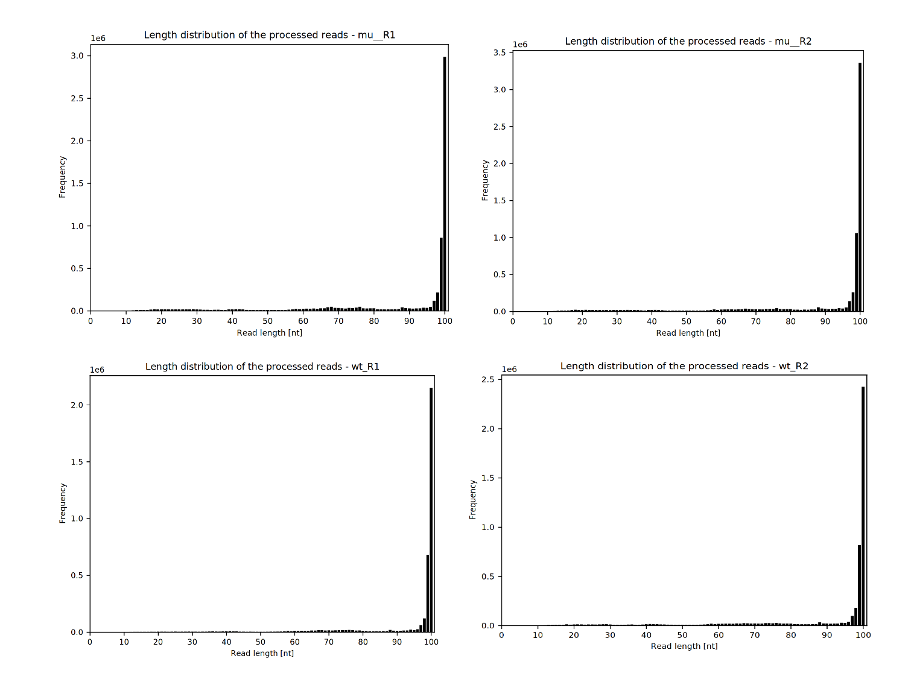

# Transcriptomics

### Dowland sequence data

https://www.ncbi.nlm.nih.gov/geo/query/acc.cgi?acc=GSE85456 
https://www.ncbi.nlm.nih.gov/sra?term=SRP081251

|Wild type | Mutants  |
|     ---         | --- |
| SRR4018515	 | SRR4018516	
| SRR4018516	|  SRR4018517	

In the terminal 
```
micromamba activate 10_grabseqs

cd $WORK/day8/reademption/READemption_analysis_2
grabseqs sra -t 4 -m ./metadata.csv SRR4018516	
grabseqs sra -t 4 -m ./metadata.csv SRR4018515	
grabseqs sra -t 4 -m ./metadata.csv SRR4018514	
grabseqs sra -t 4 -m ./metadata.csv SRR4018517	
```
Renames files
|Files name| Rename |
|     ---               | --- |
|SRR4018515.fastq.gz	| wt_R1_fastq.gz	
|SRR4018516.fastq.gz	| wt_R2_fastq.gz  
|SRR4018516.fastq.gz    | mu_R1_fastq.gz 
|SRR4018517.fastq.gz    | mu_R2_fastq.gz 

Download reference genome
```
wget -O $WORK/day8/reademption/READemption_analysis_2/input/methanosarcina_reference_sequences/GCF_000007065.1_ASM706v1_genomic.fna.gz  https://ftp.ncbi.nlm.nih.gov/genomes/all/GCF/000/007/065/GCF_000007065.1_ASM706v1/GCF_000007065.1_ASM706v1_genomic.fna.gz 
```

Download annotation 
```
wget -O $WORK/day8/reademption/READemption_analysis_2/input/methanosarcina_annotations/GCF_000007065.1_ASM706v1_genomic.gff.gz https://ftp.ncbi.nlm.nih.gov/genomes/all/GCF/000/007/065/GCF_000007065.1_ASM706v1/GCF_000007065.1_ASM706v1_genomic.gff.gz 
```
UNzip files
```
gunzip $WORK/day8/reademption/READemption_analysis_2/input/methanosarcina_reference_sequences/GCF_000007065.1_ASM706v1_genomic.fna.gz
gunzip $WORK/day8/reademption/READemption_analysis_2/input/methanosarcina_annotations/GCF_000007065.1_ASM706v1_genomic.gff.gz
```
## Run READemption
In a bash script:
```
#!/bin/bash
#SBATCH --job-name=test8
#SBATCH --output=test8.out
#SBATCH --error=test8.err
#SBATCH --nodes=1
#SBATCH --ntasks-per-node=1
#SBATCH --cpus-per-task=32
#SBATCH --mem=64G
#SBATCH --partition=base
#SBATCH --time=4:00:00
#SBATCH --reservation=biol217

module load gcc12-env/12.1.0
module load micromamba/1.4.2
eval "$(micromamba shell hook --shell=bash)"
micromamba activate 08_reademption

# align reads to reference
reademption align -p 4 --poly_a_clipping --project_path READemption_analysis_2 --fastq

# calculate read coverage
reademption coverage -p 4 --project_path READemption_analysis_2

# quantify gene expression
reademption gene_quanti -p 4 --features CDS,tRNA,rRNA --project_path READemption_analysis_2

# calculate differential expression using DESeq2
reademption deseq -l mut_R1.fastq.gz,mut_R2.fastq.gz,wt_R1.fastq.gz,wt_R2.fastq.gz -c mut,mut,wt,wt -r 1,2,1,2 --libs_by_species methanosarcina=mut_R1,mut_R2,wt_R1,wt_R2 --project_path READemption_analysis_2

# visualization
reademption viz_align --project_path READemption_analysis_2
reademption viz_gene_quanti --project_path READemption_analysis_2
reademption viz_deseq --project_path READemption_analysis_2

# environment cleanup
micromamba deactivate
module purge
jobinfo
```
### Results

 
 
 
  