How many free viruses are in the BGR_140717 sample?
846
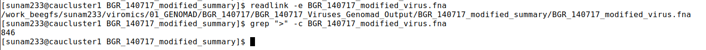
How many proviruses are in the BGR_140717 sample?
11
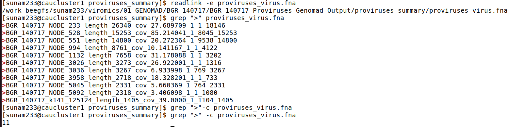
How many Caudoviricetes viruses are in all samples together? 
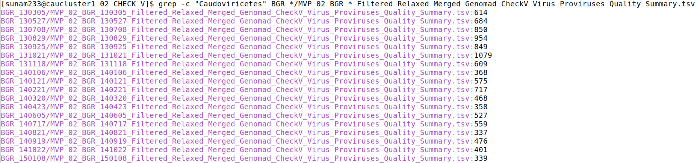
How many Unclassified viruses are in all samples together?
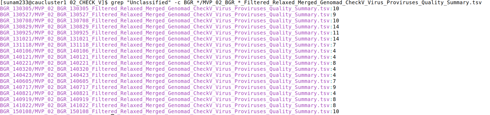
What other taxonomies are there across all files? 
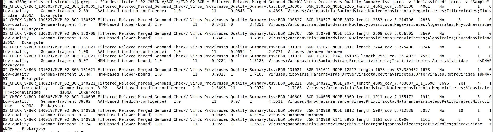

How many High-quality and Complete viruses are in all samples together? 
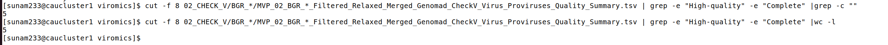
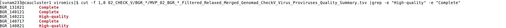

Create a table based on the CheckV quality with the columns Sample, Low-quality, Medium-quality, High-quality, Complete. Fill it with the amount of viruses for each of the categories. 
|Sample| Low-quality | Medium-quality| High-quality| Complete|
| ---   | ----       | ---             |  ---       |  ---    |
BGR_130305 | 625 | 0 | 0 | 0 
| BGR_130527 | 693 |1 | 0| 0
| BGR_130708 | 860 |1 |0|0
| BGR_130829 | 964 |3 |0 |0
| BGR_130925 | 856|3|0|0
| BGR_131021 | 1091 | 3 |0| 1
| BGR_131118 | 613300
| BGR_140106 | 372000
| BGR_140121 | 578001
| BGR_140221 | 724110
| BGR_140320 | 471100
| BGR_140423 | 362000
| BGR_140605 | 531200
| BGR_140717 | 564301
| BGR_140821 | 338110
| BGR_140919 | 485100
| BGR_141022 | 409000
| BGR_150108 | 348100

For the Complete viruses from all samples, extract all the lines 
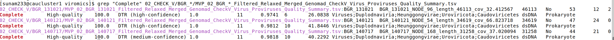
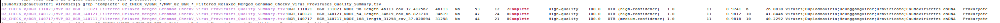
**TO SE MORE INFROMATION ABPUT THE TABLE USE: `less`**

    In what samples were the complete viruses found?  	BGR_131021_NODE_96_length_46113_cov_32.412567;BGR_140121	BGR_140121_NODE_54_length_34619_cov_66.823718; BGR_140717_NODE_168_length_31258_cov_37.020094
    Are they integrated proviruses? No
    How long are they?  BGR_131021: 46113  ; BGR_140121:34619 ; :BGR_140717: 31258
    How many viral hallmark genes do they have? BGR_131021: 12 ; BGR_140121:34619: 24; :BGR_140717: 21
    What percentage of the viral genes are viral hallmark genes? You may round to full numbers. 53:12; 47:24; 43:21
    Why are there more genes (gene_count) than viral genes and host genes combined? Tip: What does the column gene_count tell us?
## Clustering and Abundance
How many cluster representatives are there?
5375
How many of the cluster representatives are proviruses?
91
What clusters do the complete viruses from sample of previues steps belong to? How large are the clusters?
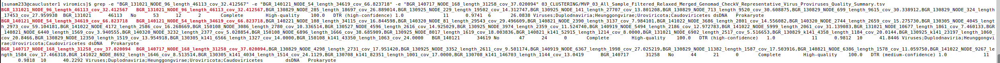
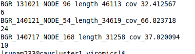

The first two columns of any file CoverM What does this file tell you, conceptionally? how many lines this file has or find the documentatio? 5374
If you scroll through the CoverM file you selected, you will come across lines where all of the metrics (except length) are zero. How could this have happened? Is it a bug or a feature?!
Merge all CoverM files for all the samples, using the file you just created, how abundant are the complete viruses in different samples (RPKM)? 
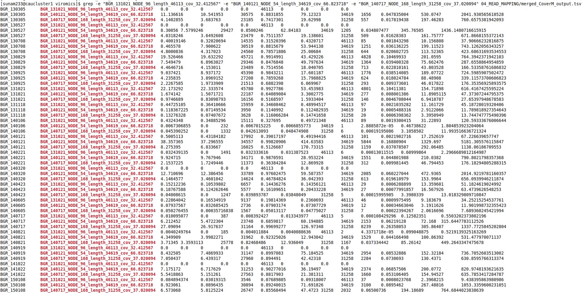
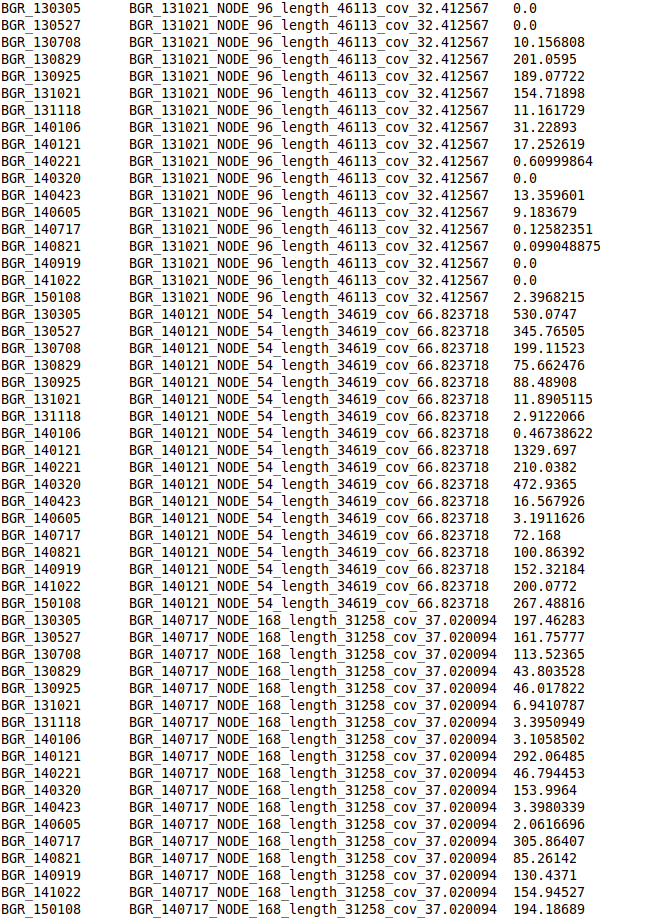

## Annotation

for MVP_06_All_Sample_Filtered_Conservative_Merged_Genomad_CheckV_Representative_Virus_Proviruses_Gene_Annotation_GENOMAD_PHROGS_PFAM_Filtered.tsv:
How many genes does the complete virus have?
What kind of genes does this virus have? 
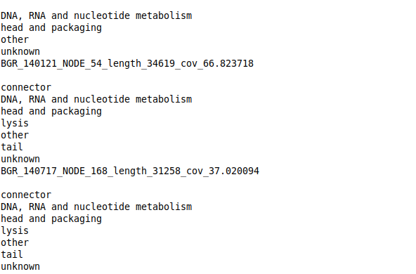
What kind of metabolism are the viruses involved in?
 Are there any toxin genes? Briefly look up the function of them (What do they do, where do they occur, what does it mean for this virus and its host?)

 ## Binning
 Open the file: MVP_07_Merged_vRhyme_Outputs_Unfiltered_best_vBins_Memberships_geNomad_CheckV_Summary_read_mapping_information_RPKM_Table.tsv
 What does each line represent (focus on column 1,2,5)? 
 How many High-quality "viruses" are there after binning?
  Filter the results so you can only see vBin_16 (or just highlight the corresponding 5 lines). The metrics for all bin members are the same. But membership_provirus has different values. What does this tell you about the vBin/vMAG 16?
  Are your complete viruses part of a bin? Why does this result make sense? 

  ## Host prediction

  Opes the file: Host_prediction_to_genome_m90.csv
  Based on the first column of the table and the name of the input file: What does each line represent?
  What hosts were predicted for the complete viruses? From what habitat did the hosts come from?
  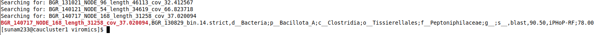